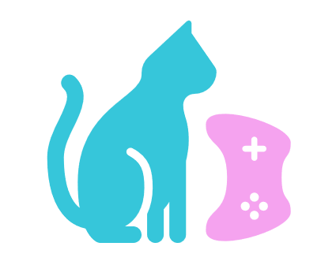

<h1 align="center">𝕜𝕚𝕥𝕥𝕪𝕡𝕪</h1> 
<h4 align="center">A light, simple game engine for ASCII graphic games. Create your own console games easily! 
Complete with scene manager and switcher, 'collision' detection (with a char, point, edge or box), character sprite switcher and movement manager, support for color (*only on sprite right now*) , start menu (*to be implemented*), in-game music and more.</h4> 
<h3 align="center">Coming Soon</h3>
